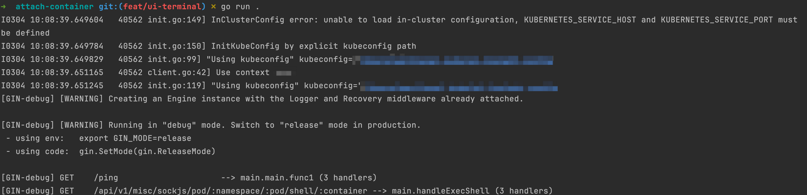

init `.env` file
```shell
cp .env.example .env
# modify the .env file as you wanted
```

for backend(api)
```shell
go run .
```
if the backend run successfully, then you can see the following:


for frontend(ui)
```shell
cd ui
pnpm install

ln -s ../.env .env
pnpm run dev
```
if the frontend run successfully, then you can see the following:


then open the browser, visit `http://localhost:5173/`, the following is the gif

